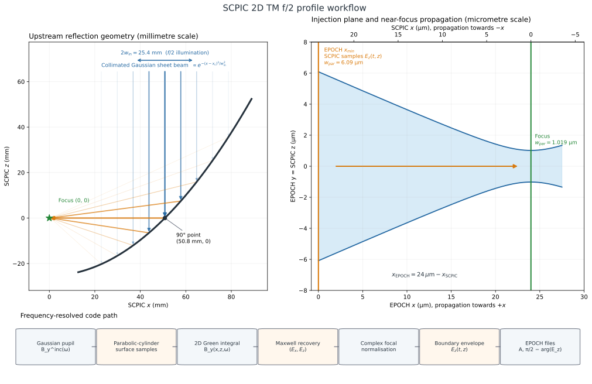

# SCPIC 2D f/2 campaign walkthrough

This document follows the exact two-dimensional profile-generation path used
by `laser_ebeam_new_design/SCPIC_test`.  It explains the incident field, the
parabolic-cylinder geometry, the physical-optics propagation, the meaning of
f/2, the comparison with a paraxial Gaussian beam, and the source-code path
from the campaign command to EPOCH-mod.



The figure is generated by
[`docs/figures/generate_2d_f2_workflow.py`](docs/figures/generate_2d_f2_workflow.py).
It deliberately uses separate millimetre and micrometre panels because the OAP
is 50.8 mm from the focus, whereas EPOCH begins only 24 µm before the focus.
Regenerate it from the repository root with:

```bash
.venv/bin/python docs/figures/generate_2d_f2_workflow.py
```

All principal dimensions can be changed from the command line; run the script
with `--help` for the available parameters.

## 1. What the campaign generates

The campaign profile is an ideal, collimated Gaussian **sheet beam** incident
on a 90-degree off-axis parabolic cylinder.  SCPIC solves the reflected field
frequency by frequency with a two-dimensional TM physical-optics boundary
integral, then samples its tangential electric field 24 µm before focus for
EPOCH injection.

The production settings are:

| Quantity | Value |
|---|---:|
| central wavelength | 0.8 µm |
| focal intensity-envelope FWHM | 60 fs |
| Gaussian-illuminated f-number | f/2 |
| effective focal length | 50.8 mm |
| EPOCH boundary-to-focus distance | 24 µm |
| mirror integration extent | ±3 incident beam radii |
| mirror samples | 6,000 |
| spectral components | 17 |
| output grid | 801 times × 1,601 transverse positions |
| time window | 0–400 fs |
| transverse window | −20–20 µm |

The source and mirror are not placed inside EPOCH.  SCPIC propagates from the
millimetre-scale reflector to the injection plane; EPOCH then propagates the
last 24 µm to focus.

## 2. Coordinates and polarisation

SCPIC works in the `(x,z)` plane and assumes translational invariance in the
omitted `y` direction.  The native reflected beam travels towards `-x` and has
TM components

$$
  (E_x,E_z,B_y).
$$

The campaign maps this onto EPOCH's beam travelling from `x_min` towards `+x`:

```text
x_epoch = focus_distance - x_scpic
y_epoch = z_scpic
E_x_epoch = -E_x_scpic
E_y_epoch = E_z_scpic
B_z_epoch = B_y_scpic
```

Thus `x_scpic=24 µm` is the EPOCH `x_min=0` injection boundary and
`x_scpic=0` is the intended EPOCH focus at `x=24 µm`.  This is a right-handed
coordinate transformation and does not require complex conjugation.

## 3. Incident field at the parabolic mirror

For every retained angular frequency, the incident magnetic phasor is

$$
B_y^{\mathrm{inc}}(x,z)
 = \frac{E_0}{c}
   \exp\!\left[-\frac{(x-x_c)^2}{w_{\mathrm{in}}^2}\right]
   \exp(-ikz).
$$

SCPIC uses the convention

$$
\text{physical field}=\operatorname{Re}\!\left[F e^{-i\omega t}\right],
$$

so `exp(-ikz)` propagates towards `-z`.  The lateral field amplitude is a
Gaussian with 1/e radius `w_in`; its intensity is proportional to
`exp[-2(x-x_c)^2/w_in^2]`.  The field is invariant in the omitted direction,
so this is a Gaussian sheet rather than a circular beam.

For the campaign,

$$
w_{\mathrm{in}}
 = \frac{f_{\mathrm{eff}}}{2N}
 = \frac{50.8\ \mathrm{mm}}{2\times2}
 = 12.7\ \mathrm{mm}.
$$

The current upstream model is deliberately ideal:

- planar incident wavefront;
- the same lateral radius at every frequency;
- no measured aberration or surface error;
- no finite upstream Rayleigh-range curvature;
- no coating transfer function;
- no non-separable space-time coupling.

The implementation is `IncidentFieldTM` in
[`src/scpic/fields.py`](src/scpic/fields.py).

## 4. Parabolic-cylinder geometry

The parent parabola is

$$
z_m(x)=\frac{x^2}{4f_0}-f_0,
$$

with focus at `(0,0)`.  The campaign sets

$$
f_0=\frac{f_{\mathrm{eff}}}{2}=25.4\ \mathrm{mm}.
$$

For the `OAP90` segment, the illuminated centre is

$$
x_c=2f_0=50.8\ \mathrm{mm}, \qquad z_c=0.
$$

The surface slope at that point is one.  A chief ray arriving along `-z` is
therefore reflected by 90 degrees along `-x`, towards the origin.

The integration surface extends to three incident beam radii on either side:

$$
D_{\mathrm{computational}}=6w_{\mathrm{in}}=76.2\ \mathrm{mm}.
$$

This is a numerical truncation, not the diameter used to define the f-number.
At either endpoint the incident field is only `exp(-9)`, about
`1.2e-4`, of its central amplitude.  Calculating `50.8/76.2` and calling the
result the f-number would therefore be misleading: the intended Gaussian
illumination is f/2 because

$$
N=\frac{f_{\mathrm{eff}}}{2w_{\mathrm{in}}}=2.
$$

The geometry, surface normals and trapezoidal line weights are constructed by
`ParabolicMirror2D` in [`src/scpic/mirrors.py`](src/scpic/mirrors.py).

## 5. Reflection and the 2D boundary integral

In this TM reduction, `B_y` obeys the scalar Helmholtz equation.  SCPIC uses
the outgoing two-dimensional Green function

$$
G(P,Q)=\frac{i}{4}H_0^{(1)}(k|P-Q|).
$$

The default perfect-conductor physical-optics boundary approximation is

$$
B_y^{\mathrm{total}}\big|_S\simeq2B_y^{\mathrm{inc}},
\qquad
\partial_nB_y^{\mathrm{total}}\big|_S\simeq0.
$$

The propagated magnetic field is consequently

$$
B_y(P)\simeq
\int_S2B_y^{\mathrm{inc}}(Q)
       \frac{\partial G(P,Q)}{\partial n_Q}\,d\ell_Q.
$$

`evaluate_SC_2D()` in [`src/scpic/solvers.py`](src/scpic/solvers.py) evaluates
this integral using Hankel functions and bounded observation chunks.  This is
a physical-optics model of a perfectly conducting reflector, not an exact
surface-current solution.  The incident normal derivative is calculated for
the alternative generic Kirchhoff mode but is not used by the default PEC
physical-optics integrand.

Once `B_y` has been propagated, Ampère's law gives

$$
E_x=-\frac{ic}{k}\frac{\partial B_y}{\partial z},
\qquad
E_z=\frac{ic}{k}\frac{\partial B_y}{\partial x}.
$$

The campaign evaluates three nearby longitudinal planes,
`x=24 µm + (-8,0,8) nm`, so that the required `x` derivative can be taken.
Only the centre plane is exported.

## 6. Spectrum and temporal reconstruction

`GaussianPulseSpectrum` in [`src/scpic/pulse.py`](src/scpic/pulse.py) constructs
a Gaussian positive-frequency energy spectrum whose reconstructed intensity
envelope has the requested 60 fs FWHM.  The production grid retains 17
components and has a discrete repetition period of approximately 543.9 fs,
which is longer than the 400 fs output window.

An important feature is that the transform-limited spectrum is imposed at the
**focus**, not at the mirror.  For each frequency, SCPIC:

1. propagates a unit-amplitude Gaussian pupil through the mirror;
2. calculates the complex focal `E_z` response;
3. divides the desired spectral coefficient by that response;
4. obtains the required upstream coefficient that produces the requested
   transform-limited focal spectrum.

This is a small inverse optical calculation.  The upstream lateral profile is
still Gaussian at every frequency, but its frequency coefficients are
precompensated for the complex mirror response.

The requested focal peak time is

$$
t_{\mathrm{focus}}
 =143.3149\ \mathrm{fs}+\frac{24\ \mu\mathrm{m}}{c}
 \simeq223.37\ \mathrm{fs}.
$$

Propagation predicts the earlier boundary arrival.  The individual frequency
fields are then reconstructed as the carrier-referenced complex envelope

$$
\widetilde E(t)
 =2\sum_n E_n\exp[-i(\omega_n-\omega_0)t].
$$

This is the appropriate quantity for EPOCH because EPOCH supplies the
`omega0*t` carrier internally.

## 7. Relationship to an f/2 Gaussian focus

For an ideal paraxial Gaussian focused by a lens or parabola,

$$
w_f=\frac{\lambda f_{\mathrm{eff}}}{\pi w_{\mathrm{in}}}
    =\frac{2\lambda N}{\pi}.
$$

For `lambda=0.8 µm` and `N=2`,

$$
w_f^{\mathrm{paraxial}}=1.01859\ \mu\mathrm{m}.
$$

The corresponding Rayleigh length is approximately `4.07 µm`.  The EPOCH
boundary is therefore about 5.9 Rayleigh lengths before focus, where a
paraxial beam would have a field radius of about `6.09 µm`.

The production SCPIC carrier calculation gives:

- focal intensity FWHM: `1.2117 µm`;
- Gaussian-equivalent 1/e field waist from that FWHM: `1.0291 µm`;
- paraxial 1/e field waist: `1.0186 µm`;
- peak longitudinal/transverse field ratio: `10.8%`;
- boundary intensity FWHM: `6.944 µm`, equivalent to a Gaussian field radius
  of about `5.90 µm`.

The dominant focal field is therefore close to the Gaussian prediction, but
it is not exactly Gaussian.  A carrier-only comparison using the same 6,000
surface samples gives:

| Metric | f/2 result |
|---|---:|
| paraxial waist | 1.0186 µm |
| central-lobe Gaussian fitted waist | 1.0507 µm |
| central-lobe Gaussian fit R² | 0.99967 |
| amplitude L2 difference from the ideal Gaussian | 3.26% |
| peak `abs(Ex)/abs(Ez)` | 10.80% |

The `1.0291 µm` manifest value is obtained by converting the intensity FWHM
under a Gaussian assumption.  The `1.0507 µm` value fits the central-lobe
shape.  Their modest disagreement is itself evidence that the result is
nearly, but not perfectly, Gaussian.

The non-Gaussian correction includes vector/angular weighting, the
longitudinal electric field, small wing differences and a non-ideal quadratic
phase.  It is not solely numerical error.

## 8. Translational 2D versus circular 3D symmetry

A radial slice through an ideal circular Gaussian and a one-dimensional
Gaussian sheet can have the same functional transverse profile at a single
plane.  Their propagation and normalisation differ:

- SCPIC2D models a parabolic cylinder and a line focus;
- a circular 3D OAP models a paraboloid and a point focus;
- 2D field gain scales approximately as
  `sqrt(w_boundary/w_focus)`;
- circular-beam field gain scales approximately as
  `w_boundary/w_focus`;
- the slab Gouy phase is half the circular 3D Gouy phase;
- 2D power is power per unit length;
- the omitted transverse dimension does not diffract.

This is why exporting a radial slice of an axisymmetric LASY field and then
evolving it as an EPOCH slab is not rigorously self-consistent, even if its
initial transverse amplitude looks almost identical.

## 9. Comparison with a directly injected 2D Gaussian

A fair paraxial Gaussian comparison must inject the complete boundary field,
not just a Gaussian amplitude.  It needs:

- the correct boundary field radius;
- the quadratic converging-wavefront phase;
- the boundary arrival and temporal envelope;
- the 2D slab amplitude scaling;
- preferably the leading Maxwell-consistent longitudinal correction.

With these matched, the dominant f/2 focal transverse field should agree with
SCPIC at approximately the few-percent level.  Expected differences include
the 1–3% waist/shape correction, spatial phase, wings, chromatic propagation
and the longitudinal component.  A Gaussian amplitude without the converging
phase will not focus at `x=24 µm`.

There is a separate EPOCH limitation: `simple_laser` accepts the tangential
electric profile and reconstructs the other fields through its characteristic
boundary update.  It does not directly receive SCPIC's longitudinal `E_x`.
The retained LASY EPOCH reference data gave only about 0.65–0.93% peak
`abs(Ex)/abs(Ey)`, whereas the direct SCPIC f/2 solution predicts 10.8%.
Consequently the full vector advantage of SCPIC is not guaranteed to survive
the current boundary injector.

## 10. The f/10 paraxial limit

At f/10 the paraxial waist would be

$$
w_f^{\mathrm{paraxial}}=5.09296\ \mu\mathrm{m}.
$$

Repeating the direct carrier comparison gives:

| Metric | f/10 result |
|---|---:|
| paraxial waist | 5.0930 µm |
| central-lobe Gaussian fitted waist | 5.0999 µm |
| transverse amplitude L2 difference | 0.138% |
| peak `abs(Ex)/abs(Ez)` | 2.146% |

The transverse field has therefore converged very closely to a paraxial
Gaussian.  The remaining transverse discrepancy is of order 0.1%, but it is
not necessarily all numerical.  Finite-angle physical-optics corrections
remain at any finite f-number.

The longitudinal component is also physical.  For a focused Gaussian, its
leading estimate is

$$
\frac{\max|E_x|}{\max|E_z|}
 \simeq\frac{\sqrt{2/e}}{kw_f}
 \simeq\frac{0.214}{N},
$$

which gives 10.7% at f/2 and 2.14% at f/10, in close agreement with the direct
SCPIC results.  A vector paraxial Gaussian includes this leading correction; a
scalar Gaussian does not.

## 11. Source-code trace

### 11.1 Campaign entry point

`SCPIC_test/slurm/generate_scpic_profile.slurm` calls:

```bash
python -m scpic.cli \
  --wavelength-um 0.8 \
  --tau-fwhm-fs 60 \
  --focus-distance-um 24 \
  --f-number 2 \
  --effective-focal-length-mm 50.8 \
  --aperture-radius-waists 3 \
  --n-surface 6000 \
  --workers 4
```

The full campaign script is outside this repository, under
`laser_ebeam_new_design/SCPIC_test/slurm/`.

### 11.2 CLI conversion

[`src/scpic/cli.py`](src/scpic/cli.py) parses the command, converts micrometres,
millimetres and femtoseconds to SI, and calls
`generate_epoch2d_oap_pulse()`.

### 11.3 Campaign profile construction

[`src/scpic/profile2d.py`](src/scpic/profile2d.py) is the central campaign
module.  `generate_epoch2d_oap_pulse()`:

1. creates the time and transverse axes;
2. constructs `GaussianPulseSpectrum`;
3. calculates `w_in=f_eff/(2*f_number)`;
4. constructs `ParabolicMirror2D` and `IncidentFieldTM`;
5. requests the three-plane boundary solution;
6. calculates the direct carrier-focus diagnostics;
7. selects `E_z` as the EPOCH tangential component;
8. exports the amplitude, phase and manifest.

### 11.4 One-frequency propagation

`_solve_unit_frequency()` in `profile2d.py`:

1. samples the incident field on the reflector;
2. calls `evaluate_SC_2D()`;
3. reshapes the scalar `B_y` result;
4. calls `electric_from_magnetic_tm()` to recover `(E_x,E_z)`;
5. optionally evaluates the focal reference response.

### 11.5 Broadband assembly

`propagate_broadband_2d()` in `profile2d.py`:

1. obtains the mirror quadrature once;
2. solves each wavenumber, optionally with shared-memory threads;
3. divides by the complex focal response;
4. adds the required linear spectral phase for the desired focal time;
5. reconstructs the carrier-referenced temporal envelope.

### 11.6 EPOCH export

[`src/scpic/export.py`](src/scpic/export.py) converts the complex envelope to
EPOCH's convention.  SCPIC uses

$$
\operatorname{Re}[F e^{-i\omega t}],
$$

whereas EPOCH injects

$$
A\sin(\omega t+\phi_{\mathrm{EPOCH}}).
$$

Therefore

$$
A=|F|,\qquad
\phi_{\mathrm{EPOCH}}=\frac{\pi}{2}-\arg F.
$$

The exporter normalises amplitude to one, regularises meaningless phase below
the selected tail threshold, unwraps phase along time and transverse axes, and
writes headerless native-float64 arrays in `(n_t,n_y)` NumPy C order.

### 11.7 EPOCH-mod consumption

The campaign deck declares:

```text
boundary = x_min
use_custom_profile = T
use_spatiotemporal_profile = T
profile_data_file = laser_amplitude.dat
use_phase_from_file = T
phase_data_file = laser_phase.dat
n_y = 1601
n_t = 801
```

EPOCH-mod reads NumPy's `(time,y)` C-order stream into its Fortran `(y,time)`
array, for which `y` is also the fastest-varying index.  It bilinearly
interpolates amplitude and phase and evaluates

```text
amplitude * sin(omega*time + phase)
```

at the `x_min` laser boundary.

## 12. Current modelling boundary

The optical calculation predicts the full 2D TM field, but the exported file
contains only the tangential component accepted by EPOCH's `simple_laser`
boundary.  A full-vector interior current-sheet injector would be needed to
impose SCPIC's longitudinal field directly.  Until that exists, every new
profile family should retain a paired EPOCH vacuum calibration and spatial
convergence check.

Two comments elsewhere can be misleading when tracing this campaign:

- copied comparison decks retain stale introductory LASY/30 fs wording even
  though their executable pulse-duration constant is 60 fs;
- an older lower section of the main README mentions an `x_max` mapping, while
  the campaign generator and campaign decks correctly use `x_min` and `+x`
  EPOCH propagation.
